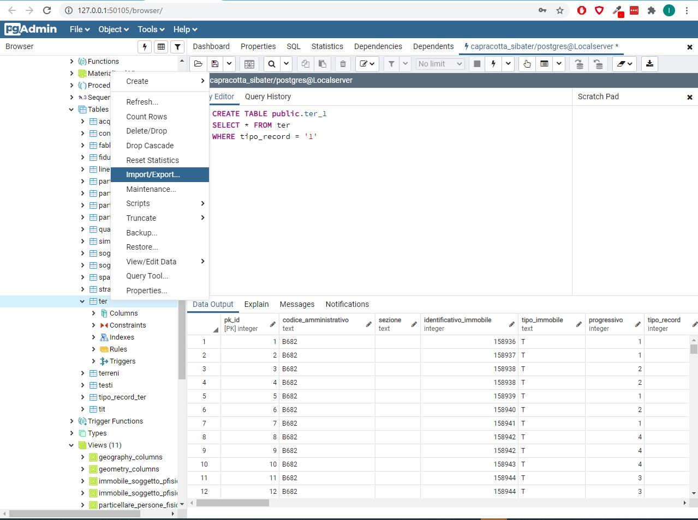

# Import-dati-censuari-in-PostgreSQL/PostGIS

## Breve descrizione dei dati catastali censuari
Le informazioni descritte in questa sezione derivano dal documento a cura dell'Agenzia dell'Entrate (DOC. ES-23-IS-05) liberamente consultabile all'indirizzo https://wwwt.agenziaentrate.gov.it/mt/ServiziComuniIstituzioni/ES-23-IS-05_100909.pdf.


Per maggiori dettagli si può consultare https://www.agenziaentrate.gov.it/portale/web/guest/schede/fabbricatiterreni/portale-per-i-comuni/servizi-portale-dei-comuni/estrazione-dati-catastali.


I dati censuari sono costituiti da 4 tipi di file:

- file fabbricati (.FAB);

- file terreni (.TER);

- file soggetti (.SOG);

- file titolarità (.TIT).


Ogni tipo di file è costituito da una tabella che può contenere diversi tipi di record. Il collegamento tra i tipi di file è assicurato dalla presenta di chiavi specifiche:

- .FAB/.TER contengono la chiave identificativo immobile;

- .SOG contiene la chiave identificativo soggetto;

- .TIT contiene sia la chiave identificativo immobile che la chiave identificativo soggetto;


## Importazione dei singoli file in PostgreSQL/PostGIS - .TER
Il file è costituito da 4 differenti tipi record. La particella è identificata attraverso il campo IDENTIFICATIVO IMMOBILE. La presenza di diversi tipi di record può creare delle righe duplicate per ogni particella.

- TIPO RECORD 1: contiene le caratteristiche della particella. E' il record di interesse che verrà utilizzato per ricostruire il dato spaziale;

- TIPO RECORD 2: deduzioni della particella;

- TIPO RECORD 3: riserva della particella;

- TIPO RECORD 4: porzioni della particella.

** Step per l'importazione del file .TER

#### 1) Creazione della tabella contenente tutti i campi (Per non crare problemi durante l'importazione è stato scelto di importare alcuni campi numerici come testi);<br>

```sql
CREATE TABLE public.ter(
  pk_id INTEGER PRIMARY KEY GENERATED BY DEFAULT AS IDENTITY,
  codice_amministrativo TEXT,
  sezione TEXT,
  identificativo_immobile INTEGER NOT NULL,
  tipo_immobile TEXT,
  progressivo INTEGER,
  tipo_record INTEGER,
  foglio TEXT,
  numero TEXT,
  denominatore INTEGER,
  subalterno TEXT,
  edificialita TEXT,
  qualita TEXT,
  classe TEXT,
  ettari INTEGER,
  are INTEGER,
  centiare INTEGER,
  flag_reddito TEXT,
  flag_porzione TEXT,
  flag_deduzioni TEXT,
  reddito_dominicale_lire INTEGER,
  reddito_agrario_lire INTEGER,
  reddito_dominicale_euro REAL,
  reddito_agrario_euro REAL,
  data_efficacia_valore_atto TEXT,
  data_registrazione_atti_valore_atto TEXT,
  tipo_nota_valore_atto TEXT,
  numero_nota_valore_atto TEXT,
  progressivo_nota_valore_atto TEXT,
  anno_nota_valore_atto TEXT,
  data_efficacia_registrazione_atto TEXT,
  data_registrazione_registrazione_atto TEXT,
  tipo_nota_registrazione_atto TEXT,
  numero_nota_registrazione_atto TEXT,
  progressivo_nota_registrazione_atto TEXT,
  anno_nota_registrazione_atto TEXT,
  partita TEXT,
  annotazione TEXT,
  identificativo_mutazione_iniziale TEXT,
  identificativo_mutazione_finale TEXT
)
```

#### 2) Importazione dei dati. Convertire il file .TER in .CSV utilizzando (si può utilizzare excel, calc, ecc.). Utilizzare la funzione di PgAdmin per l'importazione dei CSV.





#### 3) Selezione del TIPO RECORD 1


```sql
CREATE TABLE public.ter_1
(
  SELECT * FROM ter
  WHERE tipo_record = '1'
)
```

## Importazione dei singoli file in PostgreSQL/PostGIS - .SOG
Il file è costituito da 2 differenti tipi record. Il soggetto è identificato attraverso il campo IDENTIFICATIVO SOGGETTO.

- TIPO RECORD P: intestato a persona fisica;

- TIPO RECORD G: intestato a persona giuridica;

Per una corretta gestione del file è necessario suddividere il file .SOG in due tabella, una per ogni record. Tale operazione si può effetturare in excel, calc, ecc.

##### 1) Creazione della tabella per i soggetti fisici sogP, contenente tutti i campi (Per non crare problemi durante l'importazione è stato scelto di importare alcuni campi numerici come testi);

```sql
CREATE TABLE public.sogP
(	
	pk_id INTEGER PRIMARY KEY GENERATED BY DEFAULT AS IDENTITY,
	codice_amministrativo TEXT,
	sezione	TEXT,
	identificativo_soggetto	integer NOT NULL,
	tipo_soggetto TEXT,
	cognome TEXT,
	nome TEXT,
	sesso numeric,
	data_nascita TEXT,
	codice_amministratvio_comune_nascita TEXT,
	codice_fiscale	TEXT,
	indicazioni_supplementari TEXT
)
```

#### 2) Importazione dei dati. Convertire il file .SOG in .csv utilizzando (si può utilizzare excel, calc, ecc.). Utilizzare la funzione di PgAdmin per l'importazione dei CSV.

#### 3) Creazione della tabella per i soggetti giuridici sogG, contenente tutti i campi (Per non crare problemi durante l'importazione è stato scelto di importare alcuni campi numerici come testi);

```sql
CREATE TABLE public.sogG
(	
	pk_id INTEGER PRIMARY KEY GENERATED BY DEFAULT AS IDENTITY,
	codice_amministrativo TEXT,
	sezione TEXT,
	identificativo_soggetto  integer NOT NULL,
	tipo_soggetto TEXT,
	denominazione TEXT,
	codice_amministrativo_sede TEXT,
	codice_fiscale TEXT
)
```

## Importazione dei singoli file in PostgreSQL/PostGIS - .TIT
Il file contiene un unico tipo di record.

##### 1) Creazione della tabella titolarità contenente tutti i campi (Per non crare problemi durante l'importazione è stato scelto di importare alcuni campi numerici come testi);

```sql
CREATE TABLE public.tit
(
	pk_id INTEGER PRIMARY KEY GENERATED BY DEFAULT AS IDENTITY,
	codice_amministrativo TEXT,
	sezione TEXT,
	identificativo_soggetto INTEGER NOT NULL,
	tipo_soggetto TEXT,
	identificativo_immobile INTEGER NOT NULL,
	tipo_immobile TEXT,
	codice_diritto TEXT,
	titolo_non_codificato TEXT,
	quota_numeratore_possesso INTEGER,
	quota_denominatore_possesso INTEGER,
	regime TEXT,
	soggetto_riferimento TEXT,
	data_validita_atto_generato TEXT,
	tipo_nota_generato TEXT,
	numero_nota_generato TEXT,
	progressivo_nota_generato TEXT,
	anno_nota_generato TEXT,
	data_registrazione_atti_generato TEXT,
	partita TEXT,
	data_validita_atto_concluso TEXT,
	tipo_nota_concluso TEXT,
	numero_nota_concluso TEXT,
	progessivo_nota_concluso TEXT,
	anno_nota_concluso TEXT,
	data_registrazione_atti_concluso TEXT,
	identificativo_mutazione_iniziale TEXT,
	identificativo_mutazione_finale TEXT,
	identificativo_titolarita INTEGER NOT NULL
)
```

#### 2) Importazione dei dati. Convertire il file .TIT in .csv utilizzando (si può utilizzare excel, calc, ecc.). Utilizzare la funzione di PgAdmin per l'importazione dei CSV.


## Creazione delle tabella aggiuntive per la codifica dei codici
Può risultare utile creare alcune tabelle per la codifica dei codici contenuti all'interno del record descrizione particelle.

#### Tabella delle qualità colturali
```sql
CREATE TABLE public.qualita
(
	pk_id INTEGER PRIMARY KEY GENERATED BY DEFAULT AS IDENTITY,
	id_qualita TEXT,
	descrizione TEXT
)
```

Per inserire i valori utilizzare la funzione di PgAdmin per l'importazione dei CSV e utilizzare il file [qualita.csv](csv/qualita.csv)

#### Tabella delle partite speciali
```sql
CREATE TABLE public.partite_speciali_fabbricati
(
	pk_id INTEGER PRIMARY KEY GENERATED BY DEFAULT AS IDENTITY,
	codice_partita TEXT,
	descrizione TEXT
);
INSERT INTO public.partite_speciali_fabbricati (codice_partita, descrizione)
VALUES
('0', 'beni comuni censibili'),
('A', 'beni coumni non censibili'),
('R', 'fabbircati rurali'),
('C', 'unità immobiliari soppresse');

CREATE TABLE public.partite_speciali_terreni
(
	pk_id INTEGER PRIMARY KEY GENERATED BY DEFAULT AS IDENTITY,
	codice_partita TEXT,
	descrizione TEXT
);
INSERT INTO public.partite_speciali_terreni (codice_partita, descrizione)
VALUES
('1', 'aree di enti urbani e promiscui'),
('2', 'accessori comuni ad enti rurali e ad enti rurali e urbani'),
('3', 'aree di fabbircati rurali, o urbani da accertare, divisi in subalterni'),
('4', 'acque esenti da estimo'),
('5', 'strade pubbliche'),
('0', 'particelle soppresse')
```	


